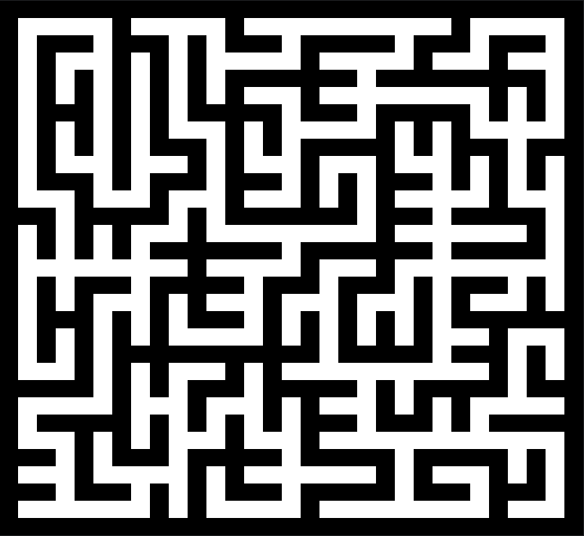

# Maze 2D
Recursive implementation of a 2d maze generation algorithm.
## Size
Able to generate a maze up to 60x60 due to call stack limits.
## Seed
Providing a seed value allows for consistent results.
## Maze representation
The maze representation is done by interpreting the ANSI escape codes stored in the `mazeWallsColored` array\
based on the directional values stored in the `maze` array.
# Sample `15x15` maze with seed `5`
